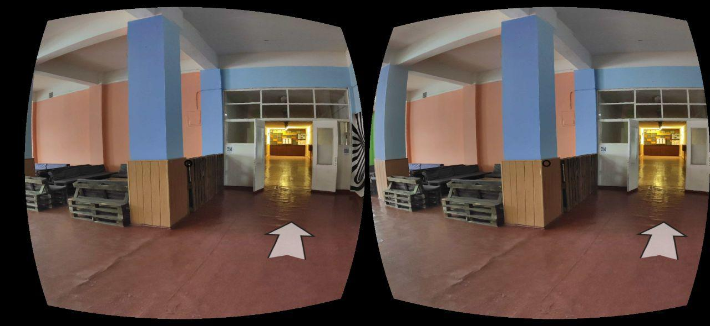

## PPC NTU "KHPI" VR Tour (ВР Тур по ППК НТУ "ХПІ")
VR Tour of [Poltava Polytechnic college](http://www.polytechnic.poltava.ua/).  
Explore all audiences, halls and other rooms from your browser!

Link: https://andreybest.github.io/ppc-vr-tour/

**WARNING!**
1. Page can load slow at first time, due to big amount of images, please wait a minute or two.
2. It is recommended to use PC, mobile phones may sometimes crash because of overload.
3. If you downloaded repository, make sure to open html files through some type of server (for example VS Code extension [Live Server](https://marketplace.visualstudio.com/items?itemName=ritwickdey.LiveServer)), if you open html file without server, it may not load pictures due to CORS policy.

TO-DO Board: [glo](https://app.gitkraken.com/glo/board/Xd4sHVfJ0wAPwq3g)

TO-DO:
1. Main menu
2. Transition animations
3. 2 floor
4. 1 floor
5. Optimisation

Made with: A-Frame, JS and love <3  
Made by: [Andrey Kotliar](https://github.com/Andreybest) and [Ivan Shapovalov](https://github.com/klas3)

## License
